# :rabbit: 감정 분석 & 위로 챗봇, 토닥토닥 :ambulance:

## 목차

- [개요](#개요)
- [설계](#설계)
- [기능](#기능)
- [AI](#ai)
- [Front-end](#front-end)
- [Back-end](#back-end)

## 개요

### 서비스 개요

- 토닥토닥 : 안드로이드 기반의 일기 작성 및 AI 기반의 일기 분석 서비스
- 기획의도 : AI의 일기 분석 결과를 제공
- 기대효과 : 사용자의 꾸준한 일기 작성을 통한 감정 변화의 분석
- 차별점 : 기존 서비스에서 불편했던 백업 및 불러오기 기능의 간편화

### 핵심 기능

- 텍스트 또는 음성으로 일기 작성
- AI 챗봇의 격려 답변 제공
- 일기 내용을 분석하여 그날의 감정 제공
- 이용자가 작성한 일기를 통해 감정 변화를 그래프로 제공

## 설계

### 기술 스택

💛 **AI**


❤ **Front End**


![GetX](https://img.shields.io/badge/GetX-711998?style=flat&logo=data:image/svg+xml;base64,PD94bWwgdmVyc2lvbj0iMS4wIiBzdGFuZGFsb25lPSJubyI/Pgo8IURPQ1RZUEUgc3ZnIFBVQkxJQyAiLS8vVzNDLy9EVEQgU1ZHIDIwMDEwOTA0Ly9FTiIKICJodHRwOi8vd3d3LnczLm9yZy9UUi8yMDAxL1JFQy1TVkctMjAwMTA5MDQvRFREL3N2ZzEwLmR0ZCI+CjxzdmcgdmVyc2lvbj0iMS4wIiB4bWxucz0iaHR0cDovL3d3dy53My5vcmcvMjAwMC9zdmciCiB3aWR0aD0iMjU2LjAwMDAwMHB0IiBoZWlnaHQ9IjIyNi4wMDAwMDBwdCIgdmlld0JveD0iMCAwIDI1Ni4wMDAwMDAgMjI2LjAwMDAwMCIKIHByZXNlcnZlQXNwZWN0UmF0aW89InhNaWRZTWlkIG1lZXQiPgoKPGcgdHJhbnNmb3JtPSJ0cmFuc2xhdGUoMC4wMDAwMDAsMjI2LjAwMDAwMCkgc2NhbGUoMC4xMDAwMDAsLTAuMTAwMDAwKSIKZmlsbD0iIzAwMDAwMCIgc3Ryb2tlPSJub25lIj4KPHBhdGggZD0iTTExNzAgMjE0OSBjLTg3IC0xNCAtMjA3IC03OCAtMjcxIC0xNDYgLTcxIC03NSAtMTA3IC0xMzcgLTEzMCAtMjI1Ci01NyAtMjE4IDMwIC00MzkgMjIyIC01NjEgNzYgLTQ4IDE0MSAtNjggMjM5IC03NCAxNDMgLTkgMjczIDM1IDM3NCAxMjggMTcyCjE1NyAyMTUgNDAxIDEwOSA2MTMgLTY2IDEzMSAtMTk3IDIyOSAtMzQ4IDI2MSAtNzcgMTYgLTExMyAxNyAtMTk1IDR6IG0yMzAKLTE4NSBjOTggLTI5IDE3NyAtODkgMjE2IC0xNjYgNjcgLTEzMiAtMyAtMzE4IC0xNTggLTQxOCAtNjYgLTQzIC0xNDMgLTY1Ci0xOTIgLTU2IC01NSAxMSAtMTEyIDY5IC0xNTUgMTU5IC04MSAxNzAgLTEwOSAzMDUgLTc4IDM3OCAxNyA0MSA2NiA4MiAxMjMKMTAzIDUzIDIwIDE3OCAyMCAyNDQgMHoiLz4KPHBhdGggZD0iTTY1NSAxMTk4IGMtODQgLTkgLTE4MiAtNTEgLTI1MCAtMTA2IC0xOTcgLTE1OSAtMjQ4IC00NDAgLTExOSAtNjU5CjU5IC0xMDEgMTg4IC0xOTcgMzA4IC0yMjkgMTY5IC00NSAzNjkgMTAgNDk1IDEzNyAyNDIgMjQzIDE3MyA2NTYgLTEzNSA4MDgKLTMzIDE2IC02OSAzMiAtODEgMzUgLTQ0IDE0IC0xNTkgMjEgLTIxOCAxNHogbTE4NiAtMTgzIGMxMDEgLTI2IDE5OSAtOTkgMjQyCi0xODAgMzIgLTYxIDI5IC0xNjIgLTYgLTIzOCAtNTQgLTExOSAtMTkyIC0yMTggLTMxMiAtMjI1IC03NiAtNCAtMTE4IDE3Ci0xNjIgODEgLTUwIDc0IC0xMTMgMjkwIC0xMTMgMzg1IDAgNDQgMjkgMTA5IDU5IDEzNiA1NiA1MCAxODggNjkgMjkyIDQxeiIvPgo8cGF0aCBkPSJNMTc3MCAxMTk5IGMtMTU4IC0xNyAtMjk5IC0xMTEgLTM4OCAtMjYwIC0yOCAtNDcgLTYyIC0xNzggLTYyIC0yMzkKMCAtMjMwIDE1OSAtNDM2IDM4MSAtNDk1IDcwIC0xOSAxOTAgLTE5IDI2MiAwIDE3MiA0NSAzMTggMTg5IDM2MyAzNTkgMTggNjYKMTggMTk2IDAgMjYyIC0zNCAxMzAgLTEzNiAyNTUgLTI1NSAzMTggLTk4IDUwIC0xODcgNjYgLTMwMSA1NXogbTI0MCAtMjExCmMxMzUgLTYzIDIwNSAtMTU5IDIwNCAtMjc5IDAgLTg4IC0zNSAtMTU5IC0xMTMgLTIzMiAtOTQgLTg2IC0yMzkgLTEzMSAtMzIxCi05OSAtNDEgMTYgLTg4IDcyIC0xMDkgMTI4IC01NCAxNDMgLTczIDM1OCAtMzcgNDIzIDM5IDczIDEwOCAxMDMgMjI2IDk4IDYwCi0zIDkwIC0xMCAxNTAgLTM5eiIvPgo8L2c+Cjwvc3ZnPgo=)

💙 **Back End**
![Java](https://img.shields.io/badge/Java-f1f0ff?style=flat&logo=data:image/svg+xml;base64,PHN2ZyB4bWxucz0iaHR0cDovL3d3dy53My5vcmcvMjAwMC9zdmciICB2aWV3Qm94PSIwIDAgNDggNDgiIHdpZHRoPSI0ODBweCIgaGVpZ2h0PSI0ODBweCI+PHBhdGggZmlsbD0iI0Y0NDMzNiIgZD0iTTIzLjY1LDI0Ljg5OGMtMC45OTgtMS42MDktMS43MjItMi45NDMtMi43MjUtNS40NTVDMTkuMjI5LDE1LjIsMzEuMjQsMTEuMzY2LDI2LjM3LDMuOTk5YzIuMTExLDUuMDg5LTcuNTc3LDguMjM1LTguNDc3LDEyLjQ3M0MxNy4wNywyMC4zNywyMy42NDUsMjQuODk4LDIzLjY1LDI0Ljg5OHoiLz48cGF0aCBmaWxsPSIjRjQ0MzM2IiBkPSJNMjMuODc4LDE3LjI3Yy0wLjE5MiwyLjUxNiwyLjIyOSwzLjg1NywyLjI5OSw1LjY5NWMwLjA1NiwxLjQ5Ni0xLjQ0NywyLjc0My0xLjQ0NywyLjc0M3MyLjcyOC0wLjUzNiwzLjU3OS0yLjgxOGMwLjk0NS0yLjUzNC0xLjgzNC00LjI2OS0xLjU0OC02LjI5OGMwLjI2Ny0xLjkzOCw2LjAzMS01LjU0Myw2LjAzMS01LjU0M1MyNC4zMTEsMTEuNjExLDIzLjg3OCwxNy4yN3oiLz48Zz48cGF0aCBmaWxsPSIjMTU2NUMwIiBkPSJNMzIuMDg0IDI1LjA1NWMxLjc1NC0uMzk0IDMuMjMzLjcyMyAzLjIzMyAyLjAxIDAgMi45MDEtNC4wMjEgNS42NDMtNC4wMjEgNS42NDNzNi4yMjUtLjc0MiA2LjIyNS01LjUwNUMzNy41MjEgMjQuMDUzIDM0LjQ2NCAyMy4yNjYgMzIuMDg0IDI1LjA1NXpNMjkuMTI5IDI3LjM5NWMwIDAgMS45NDEtMS4zODMgMi40NTgtMS45MDItNC43NjMgMS4wMTEtMTUuNjM4IDEuMTQ3LTE1LjYzOC4yNjkgMC0uODA5IDMuNTA3LTEuNjM4IDMuNTA3LTEuNjM4cy03Ljc3My0uMTEyLTcuNzczIDIuMTgxQzExLjY4MyAyOC42OTUgMjEuODU4IDI4Ljg2NiAyOS4xMjkgMjcuMzk1eiIvPjxwYXRoIGZpbGw9IiMxNTY1QzAiIGQ9Ik0yNy45MzUsMjkuNTcxYy00LjUwOSwxLjQ5OS0xMi44MTQsMS4wMi0xMC4zNTQtMC45OTNjLTEuMTk4LDAtMi45NzQsMC45NjMtMi45NzQsMS44ODljMCwxLjg1Nyw4Ljk4MiwzLjI5MSwxNS42MywwLjU3MkwyNy45MzUsMjkuNTcxeiIvPjxwYXRoIGZpbGw9IiMxNTY1QzAiIGQ9Ik0xOC42ODYsMzIuNzM5Yy0xLjYzNiwwLTIuNjk1LDEuMDU0LTIuNjk1LDEuODIyYzAsMi4zOTEsOS43NiwyLjYzMiwxMy42MjcsMC4yMDVsLTIuNDU4LTEuNjMyQzI0LjI3MSwzNC40MDQsMTcuMDE0LDM0LjU3OSwxOC42ODYsMzIuNzM5eiIvPjxwYXRoIGZpbGw9IiMxNTY1QzAiIGQ9Ik0zNi4yODEsMzYuNjMyYzAtMC45MzYtMS4wNTUtMS4zNzctMS40MzMtMS41ODhjMi4yMjgsNS4zNzMtMjIuMzE3LDQuOTU2LTIyLjMxNywxLjc4NGMwLTAuNzIxLDEuODA3LTEuNDI3LDMuNDc3LTEuMDkzbC0xLjQyLTAuODM5QzExLjI2LDM0LjM3NCw5LDM1LjgzNyw5LDM3LjAxN0M5LDQyLjUyLDM2LjI4MSw0Mi4yNTUsMzYuMjgxLDM2LjYzMnoiLz48cGF0aCBmaWxsPSIjMTU2NUMwIiBkPSJNMzksMzguNjA0Yy00LjE0Niw0LjA5NS0xNC42NTksNS41ODctMjUuMjMxLDMuMDU3QzI0LjM0MSw0Ni4xNjQsMzguOTUsNDMuNjI4LDM5LDM4LjYwNHoiLz48L2c+PC9zdmc+)

![JPA](https://img.shields.io/badge/JPA-696970?style=flat&logo=data:image/svg+xml;base64,PD94bWwgdmVyc2lvbj0iMS4wIiBlbmNvZGluZz0idXRmLTgiPz4NCjwhLS0gVXBsb2FkZWQgdG86IFNWRyBSZXBvLCB3d3cuc3ZncmVwby5jb20sIEdlbmVyYXRvcjogU1ZHIFJlcG8gTWl4ZXIgVG9vbHMgLS0+DQo8c3ZnIGZpbGw9IiMwMDAwMDAiIHdpZHRoPSI4MDBweCIgaGVpZ2h0PSI4MDBweCIgdmlld0JveD0iMCAtOCA0OCA0OCIgdmVyc2lvbj0iMS4xIiB4bWxucz0iaHR0cDovL3d3dy53My5vcmcvMjAwMC9zdmciPg0KPHRpdGxlPmpwYTwvdGl0bGU+DQo8cGF0aCBkPSJNNS4wNjMgMTMuNTMxYy0wLjA5NCAwLTAuMTI1LTAuMDMxLTAuMTg4LTAuMDYzLTAuMDMxLTAuMDYzLTAuMDMxLTAuMTI1LTAuMDMxLTAuMjE5czAtMC4xODggMC4wMzEtMC4yMTljMC4wNjMtMC4wNjMgMC4wOTQtMC4wOTQgMC4xODgtMC4wOTQgMC4wNjMgMCAwLjEyNSAwLjAzMSAwLjE1NiAwLjA5NCAwLjAzMSAwLjAzMSAwLjA2MyAwLjEyNSAwLjA2MyAwLjIxOXMtMC4wMzEgMC4xNTYtMC4wNjMgMC4yMTljLTAuMDMxIDAuMDMxLTAuMDk0IDAuMDYzLTAuMTU2IDAuMDYzek04LjQwNiA5Ljk2OWMtMC4wMzEgMC0wLjA5NCAwLTAuMTI1LTAuMDMxLTAuMDYzLTAuMDMxLTAuMDk0LTAuMTI1LTAuMDk0LTAuMjE5IDAtMC4wNjMgMC4wMzEtMC4xMjUgMC4wMzEtMC4xODggMC4wMzEtMC4wNjMgMC4wOTQtMC4xMjUgMC4xODgtMC4xMjVzMC4xMjUgMC4wMzEgMC4xNTYgMC4wOTQgMC4wNjMgMC4xMjUgMC4wNjMgMC4xODgtMC4wMzEgMC4xNTYtMC4wNjMgMC4yMTktMC4wOTQgMC4wNjMtMC4xNTYgMC4wNjN6TTcuMzEzIDEzLjU2M2MtMC4wMzEgMC0wLjA2MyAwLTAuMDk0LTAuMDMxIDAgMC0wLjAzMS0wLjAzMS0wLjAzMS0wLjA5NCAwLTAuMDMxIDAuMDMxLTAuMDYzIDAuMDYzLTAuMDk0czAuMDYzLTAuMDMxIDAuMTI1LTAuMDMxbDAuMDYzLTAuMDMxaDAuMDYzbDAuMDMxLTAuMDMxdjAuMDk0YzAgMC4wOTQtMC4wMzEgMC4xNTYtMC4wNjMgMC4xODhzLTAuMDk0IDAuMDMxLTAuMTU2IDAuMDMxek0yLjI4MSAxMy4yMTloLTAuMzQ0bDAuMTU2LTAuNXpNNy40MDYgOS43NWgwLjAzMWMwLjAzMSAwIDAuMDYzLTAuMDMxIDAuMDk0LTAuMDMxaDAuMDMxdjAuMDYzYzAgMC4wOTQtMC4wMzEgMC4xNTYtMC4wNjMgMC4xODgtMC4wNjMgMC4wMzEtMC4wOTQgMC4wMzEtMC4xNTYgMC4wMzFoLTAuMDk0YzAtMC4wMzEtMC4wMzEtMC4wNjMtMC4wMzEtMC4wOTQgMC0wLjA2MyAwLjAzMS0wLjA5NCAwLjA2My0wLjEyNSAwLjAzMSAwIDAuMDYzLTAuMDMxIDAuMTI1LTAuMDMxek04LjUgMTEuMjE5Yy0wLjAzMSAwLjAzMS0wLjA2MyAwLjAzMS0wLjEyNSAwLjAzMWgtMC4yNXYtMC4zNzVoMC4yNWMwLjA2MyAwIDAuMDk0IDAuMDMxIDAuMTI1IDAuMDYzIDAuMDYzIDAgMC4wNjMgMC4wNjMgMC4wNjMgMC4xMjVzMCAwLjEyNS0wLjA2MyAwLjE1NnpNOS4zNDQgMTEuMTg4YzAuMDYzIDAgMC4wOTQgMCAwLjE1NiAwLjAzMSAwLjAzMSAwLjAzMSAwLjA2MyAwLjA5NCAwLjA2MyAwLjE1NmgtMC40MzhjMC0wLjA2MyAwLjAzMS0wLjEyNSAwLjA2My0wLjE1NnMwLjA5NC0wLjAzMSAwLjE1Ni0wLjAzMXpNOS4zNDQgMTIuOTM4YzAuMDYzIDAgMC4xMjUgMC4wMzEgMC4xNTYgMC4wOTQgMC4wMzEgMC4wMzEgMC4wNjMgMC4xMjUgMC4wNjMgMC4yMTlzLTAuMDMxIDAuMTU2LTAuMDYzIDAuMjE5Yy0wLjAzMSAwLjAzMS0wLjA5NCAwLjA2My0wLjE1NiAwLjA2My0wLjA5NCAwLTAuMTU2LTAuMDMxLTAuMTg4LTAuMDYzLTAuMDMxLTAuMDYzLTAuMDYzLTAuMTI1LTAuMDYzLTAuMjE5czAuMDMxLTAuMTg4IDAuMDYzLTAuMjE5YzAuMDMxLTAuMDYzIDAuMDk0LTAuMDk0IDAuMTg4LTAuMDk0ek0xMS42ODggOC42NTZoMjcuMTI1YzUuMjgxIDAgOS41MzEgMy43NSA5LjUzMSA4LjM0NHYxMC4xNTZoLTM1LjA2M2MtNS4yNSAwLTkuNTMxLTMuNzE5LTkuNTMxLTguMzEzdi0zLjA2M2MtMi4xODgtMC44MTMtMy43NS0yLjc1LTMuNzUtNS4wMzEgMC0zLjAzMSAyLjcxOS01LjQ2OSA2LjA2My01LjQ2OSAyLjU2MyAwIDQuNzE5IDEuNDA2IDUuNjI1IDMuMzc1ek0xMC4xNTYgOS4yMTloLTAuMjE5djAuOTM4aDAuMjV2LTAuNjU2YzAuMDMxLTAuMDYzIDAuMDk0LTAuMDk0IDAuMTg4LTAuMDk0IDAuMDYzIDAgMC4wOTQgMC4wMzEgMC4xMjUgMC4wNjNzMC4wMzEgMC4wNjMgMC4wMzEgMC4xMjV2MC41NjNoMC4yNXYtMC42MjVjMC0wLjEyNS0wLjAzMS0wLjIxOS0wLjA5NC0wLjI1LTAuMDYzLTAuMDYzLTAuMTU2LTAuMDk0LTAuMjUtMC4wOTQtMC4wNjMgMC0wLjEyNSAwLjAzMS0wLjE4OCAwLjA2M2wtMC4wOTQgMC4wOTR2LTAuMTI1ek0xMC41IDEzLjAzMWMwLjAzMSAwLjAzMSAwLjAzMSAwLjA2MyAwLjAzMSAwLjA5NHYwLjU5NGgwLjI1di0wLjY1NmMwLTAuMDk0LTAuMDMxLTAuMTg4LTAuMDk0LTAuMjUtMC4wNjMtMC4wMzEtMC4xNTYtMC4wNjMtMC4yNS0wLjA2My0wLjA2MyAwLTAuMTI1IDAtMC4xODggMC4wNjMtMC4wMzEgMC0wLjA2MyAwLjA2My0wLjA5NCAwLjA5NHYtMC4xMjVoLTAuMjE5djAuOTM4aDAuMjV2LTAuNjU2YzAuMDMxLTAuMDYzIDAuMDk0LTAuMTI1IDAuMTg4LTAuMTI1IDAuMDYzIDAgMC4wOTQgMC4wMzEgMC4xMjUgMC4wOTR6TTEwLjUzMSAxMC42NTZ2MS4yODFoMC4yNXYtMS4yODFoLTAuMjV6TTEwLjEyNSAxMWgtMC4yMTl2MC45MzhoMC4yNXYtMC40MzhjMC0wLjA5NCAwLTAuMTU2IDAuMDMxLTAuMTg4IDAuMDMxLTAuMDYzIDAuMDk0LTAuMDk0IDAuMTg4LTAuMDk0aDAuMDYzdi0wLjI1aC0wLjAzMWMtMC4wNjMgMC0wLjEyNSAwLjAzMS0wLjE4OCAwLjA2MyAwIDAuMDMxLTAuMDYzIDAuMDYzLTAuMDk0IDAuMTI1di0wLjE1NnpNOS40NjkgOS40MDZjMC4wMzEgMC4wMzEgMC4wNjMgMC4wNjMgMC4wNjMgMC4wOTRzLTAuMDMxIDAuMDYzLTAuMDYzIDAuMDYzLTAuMDYzIDAuMDMxLTAuMDk0IDAuMDMxaC0wLjA5NGMtMC4wOTQgMC4wMzEtMC4xNTYgMC4wMzEtMC4yMTkgMC4wNjMtMC4wOTQgMC4wNjMtMC4xMjUgMC4xMjUtMC4xMjUgMC4yNSAwIDAuMDk0IDAuMDMxIDAuMTU2IDAuMDk0IDAuMjE5IDAuMDMxIDAuMDMxIDAuMTI1IDAuMDYzIDAuMTg4IDAuMDYzIDAuMDk0IDAgMC4xNTYgMCAwLjE4OC0wLjAzMSAwLjA2My0wLjAzMSAwLjA5NC0wLjA2MyAwLjEyNS0wLjA5NHYwLjA2M2MwIDAgMCAwLjAzMSAwLjAzMSAwLjAzMWgwLjI1di0wLjAzMXMtMC4wMzEgMC0wLjAzMS0wLjAzMXYtMC41OTRjMC0wLjEyNS0wLjA2My0wLjE4OC0wLjEyNS0wLjI1LTAuMDk0LTAuMDMxLTAuMTg4LTAuMDYzLTAuMjgxLTAuMDYzLTAuMTU2IDAtMC4yODEgMC4wNjMtMC4zNDQgMC4xMjUtMC4wMzEgMC4wNjMtMC4wNjMgMC4xMjUtMC4wNjMgMC4yMTloMC4yNWMwLTAuMDMxIDAtMC4wNjMgMC4wMzEtMC4wOTQgMC0wLjAzMSAwLjA2My0wLjAzMSAwLjEyNS0wLjAzMWgwLjA5NHpNOS4yMTkgMTEuNzVjLTAuMDYzLTAuMDYzLTAuMDk0LTAuMTI1LTAuMDk0LTAuMjE5aDAuNjg4di0wLjE4OGMtMC4wMzEtMC4wNjMtMC4wMzEtMC4xMjUtMC4wOTQtMC4xODgtMC4wMzEtMC4wNjMtMC4wOTQtMC4xMjUtMC4xNTYtMC4xNTZzLTAuMTI1LTAuMDMxLTAuMjE5LTAuMDMxYy0wLjEyNSAwLTAuMjUgMC4wMzEtMC4zNDQgMC4xMjVzLTAuMTI1IDAuMjE5LTAuMTI1IDAuMzc1YzAgMC4xODggMC4wNjMgMC4zMTMgMC4xNTYgMC4zNzUgMC4wOTQgMC4wOTQgMC4xODggMC4xMjUgMC4zMTMgMC4xMjUgMC4xNTYgMCAwLjI4MS0wLjAzMSAwLjM3NS0wLjEyNWwwLjA5NC0wLjE4OGgtMC4yNWMtMC4wMzEgMC4wMzEtMC4wMzEgMC4wNjMtMC4wNjMgMC4wNjMtMC4wMzEgMC4wMzEtMC4wOTQgMC4wNjMtMC4xMjUgMC4wNjMtMC4wNjMgMC0wLjEyNS0wLjAzMS0wLjE1Ni0wLjAzMXpNOS44MTMgMTMuMjVjMC0wLjE1Ni0wLjAzMS0wLjI1LTAuMTI1LTAuMzc1LTAuMDYzLTAuMDk0LTAuMTg4LTAuMTI1LTAuMzQ0LTAuMTI1LTAuMTg4IDAtMC4zMTMgMC4wMzEtMC4zNzUgMC4xMjUtMC4wOTQgMC4xMjUtMC4xMjUgMC4yMTktMC4xMjUgMC4zNzUgMCAwLjEyNSAwLjAzMSAwLjI1IDAuMTI1IDAuMzQ0IDAuMDYzIDAuMDk0IDAuMTg4IDAuMTU2IDAuMzc1IDAuMTU2IDAuMTU2IDAgMC4yODEtMC4wNjMgMC4zNDQtMC4xNTYgMC4wOTQtMC4wOTQgMC4xMjUtMC4yMTkgMC4xMjUtMC4zNDR6TTguMTg4IDkuMjE5aC0wLjIxOXYxLjMxM2gwLjI1di0wLjVjMCAwLjA2MyAwLjAzMSAwLjA5NCAwLjA2MyAwLjA5NCAwLjA2MyAwLjAzMSAwLjEyNSAwLjA2MyAwLjE4OCAwLjA2MyAwLjEyNSAwIDAuMjE5LTAuMDMxIDAuMzEzLTAuMTI1IDAuMDYzLTAuMDk0IDAuMDk0LTAuMjE5IDAuMDk0LTAuMzc1cy0wLjAzMS0wLjI4MS0wLjEyNS0wLjM3NWMtMC4wNjMtMC4wNjMtMC4xNTYtMC4xMjUtMC4yODEtMC4xMjUtMC4wNjMgMC0wLjEyNSAwLjAzMS0wLjE4OCAwLjA2M2wtMC4wOTQgMC4wOTR2LTAuMTI1ek04LjQwNiAxMC42NTZoLTAuNTMxdjEuMjgxaDAuMjV2LTAuNDY5aDAuMjgxYzAuMTI1IDAgMC4yNS0wLjAzMSAwLjMxMy0wLjA5NHMwLjEyNS0wLjE1NiAwLjEyNS0wLjMxM2MwLTAuMTI1LTAuMDYzLTAuMjUtMC4xMjUtMC4zMTNzLTAuMTg4LTAuMDk0LTAuMzEzLTAuMDk0ek04LjQ2OSAxMi40Mzh2MC4yMTloMC4yNXYtMC4yMTloLTAuMjV6TTguNzE5IDEzLjcxOXYtMC45MzhoLTAuMjV2MC45MzhoMC4yNXpNOC4yNSAxMy41MzFjLTAuMDMxLTAuMDMxLTAuMDMxLTAuMDMxLTAuMDMxLTAuMDk0di0wLjQ2OWgwLjE1NnYtMC4xODhoLTAuMTU2di0wLjI4MWgtMC4yNXYwLjI4MWgtMC4xMjV2MC4xODhoMC4xMjV2MC41NjNjMCAwLjA2MyAwLjAzMSAwLjA5NCAwLjA2MyAwLjEyNSAwLjAzMSAwLjA2MyAwLjA5NCAwLjA2MyAwLjIxOSAwLjA2M2gwLjEyNXYtMC4xODhoLTAuMTI1ek03LjUzMSA5LjQwNmMwLjAzMSAwLjAzMSAwLjAzMSAwLjA2MyAwLjAzMSAwLjA5NHMwIDAuMDYzLTAuMDYzIDAuMDYzYzAgMC0wLjAzMSAwLjAzMS0wLjA5NCAwLjAzMWgtMC4wNjNjLTAuMTI1IDAuMDMxLTAuMTg4IDAuMDMxLTAuMjE5IDAuMDYzLTAuMDk0IDAuMDYzLTAuMTU2IDAuMTI1LTAuMTU2IDAuMjUgMCAwLjA5NCAwLjAzMSAwLjE1NiAwLjA5NCAwLjIxOSAwLjA2MyAwLjAzMSAwLjEyNSAwLjA2MyAwLjIxOSAwLjA2MyAwLjA2MyAwIDAuMTI1IDAgMC4xODgtMC4wMzFsMC4wOTQtMC4wOTRjMCAwIDAgMC4wMzEgMC4wMzEgMC4wNjN2MC4wMzFoMC4yODF2LTAuMDMxYy0wLjAzMSAwLTAuMDMxIDAtMC4wMzEtMC4wMzEtMC4wMzEgMC0wLjAzMS0wLjAzMS0wLjAzMS0wLjA2M3YtMC41MzFjMC0wLjEyNS0wLjAzMS0wLjE4OC0wLjEyNS0wLjI1LTAuMDYzLTAuMDMxLTAuMTU2LTAuMDYzLTAuMjgxLTAuMDYzLTAuMTU2IDAtMC4yNSAwLjA2My0wLjM0NCAwLjEyNS0wLjAzMSAwLjA2My0wLjA2MyAwLjEyNS0wLjA2MyAwLjIxOWgwLjI1YzAtMC4wMzEgMC0wLjA2MyAwLjAzMS0wLjA5NHMwLjA2My0wLjAzMSAwLjEyNS0wLjAzMWgwLjEyNXpNNy4wOTQgMTMuMjE5Yy0wLjA5NCAwLjAzMS0wLjE1NiAwLjEyNS0wLjE1NiAwLjI1IDAgMC4wOTQgMC4wMzEgMC4xNTYgMC4wOTQgMC4xODggMC4wNjMgMC4wNjMgMC4xMjUgMC4wOTQgMC4yMTkgMC4wOTQgMC4wNjMgMCAwLjEyNS0wLjAzMSAwLjE4OC0wLjA2MyAwLjAzMS0wLjAzMSAwLjA2My0wLjA2MyAwLjEyNS0wLjA5NHYwLjEyNWgwLjI4MXYtMC4wMzFsLTAuMDMxLTAuMDMxYy0wLjAzMS0wLjAzMS0wLjAzMS0wLjAzMS0wLjAzMS0wLjA2M3YtMC41NjNjMC0wLjA5NC0wLjAzMS0wLjE4OC0wLjEyNS0wLjIxOS0wLjA2My0wLjAzMS0wLjE1Ni0wLjA2My0wLjI4MS0wLjA2My0wLjE1NiAwLTAuMjUgMC4wMzEtMC4zMTMgMC4xMjUtMC4wNjMgMC4wNjMtMC4wNjMgMC4xMjUtMC4wOTQgMC4xODhoMC4yNWMwLTAuMDMxIDAuMDMxLTAuMDYzIDAuMDMxLTAuMDYzIDAuMDMxLTAuMDMxIDAuMDYzLTAuMDYzIDAuMTI1LTAuMDYzczAuMDk0IDAgMC4xMjUgMC4wMzFjMC4wMzEgMCAwLjAzMSAwLjAzMSAwLjAzMSAwLjA5NCAwIDAuMDMxIDAgMC4wMzEtMC4wMzEgMC4wNjNoLTAuMTI1bC0wLjA2MyAwLjAzMWMtMC4wOTQgMC0wLjE4OCAwLjAzMS0wLjIxOSAwLjA2M3pNNi4zMTMgOS42ODhoLTAuMjgxdjAuMDMxYzAgMC4xMjUgMC4wMzEgMC4yNSAwLjA5NCAwLjM0NHMwLjE1NiAwLjEyNSAwLjM0NCAwLjEyNWMwLjE1NiAwIDAuMjUtMC4wNjMgMC4zMTMtMC4xNTYgMC4wNjMtMC4wNjMgMC4wNjMtMC4xNTYgMC4wNjMtMC4yNXYtMC45MDZoLTAuMjV2MC45MDZjMCAwLjA2My0wLjAzMSAwLjA5NC0wLjAzMSAwLjEyNS0wLjAzMSAwLjA2My0wLjA2MyAwLjA2My0wLjEyNSAwLjA2M3MtMC4wOTQgMC0wLjA5NC0wLjA2M2MtMC4wMzEtMC4wMzEtMC4wMzEtMC4wOTQtMC4wMzEtMC4xODh2LTAuMDMxek02LjU5NCAxMi40Mzh2MC4yMTloMC4yNXYtMC4yMTloLTAuMjV6TTYuODQ0IDEzLjcxOXYtMC45MzhoLTAuMjV2MC45MzhoMC4yNXpNNS43MTkgMTIuODc1Yy0wLjA2MyAwLjA5NC0wLjEyNSAwLjIxOS0wLjEyNSAwLjM3NXMwLjA2MyAwLjI4MSAwLjEyNSAwLjM3NWMwLjA2MyAwLjA2MyAwLjE4OCAwLjEyNSAwLjM0NCAwLjEyNSAwLjEyNSAwIDAuMjUtMC4wNjMgMC4zNDQtMC4xNTYgMC4wMzEtMC4wNjMgMC4wNjMtMC4xNTYgMC4wNjMtMC4yMTloLTAuMjVjMCAwLjAzMS0wLjAzMSAwLjA5NC0wLjAzMSAwLjEyNS0wLjAzMSAwLjAzMS0wLjA2MyAwLjAzMS0wLjEyNSAwLjAzMS0wLjA5NCAwLTAuMTU2LTAuMDMxLTAuMTg4LTAuMTI1di0wLjMxM2MwLjAzMS0wLjA5NCAwLjA5NC0wLjEyNSAwLjE4OC0wLjEyNSAwLjA2MyAwIDAuMDk0IDAgMC4xMjUgMC4wMzFzMC4wMzEgMC4wNjMgMC4wMzEgMC4wOTRoMC4yNWMwLTAuMTI1LTAuMDYzLTAuMjE5LTAuMTI1LTAuMjgxLTAuMDYzLTAuMDMxLTAuMTg4LTAuMDYzLTAuMjgxLTAuMDYzLTAuMTU2IDAtMC4yNSAwLjAzMS0wLjM0NCAwLjEyNXpNNC42ODggMTIuODc1Yy0wLjA2MyAwLjEyNS0wLjEyNSAwLjIxOS0wLjEyNSAwLjM3NSAwIDAuMTI1IDAuMDYzIDAuMjUgMC4xMjUgMC4zNDQgMC4wOTQgMC4wOTQgMC4yMTkgMC4xNTYgMC4zNzUgMC4xNTZzMC4yODEtMC4wNjMgMC4zNDQtMC4xNTZjMC4wOTQtMC4wOTQgMC4xMjUtMC4yMTkgMC4xMjUtMC4zNDQgMC0wLjE1Ni0wLjAzMS0wLjI1LTAuMTI1LTAuMzc1LTAuMDYzLTAuMDk0LTAuMTg4LTAuMTI1LTAuMzQ0LTAuMTI1cy0wLjI4MSAwLjAzMS0wLjM3NSAwLjEyNXpNMi4zNDQgMTMuNDM4bDAuMDYzIDAuMjgxaDAuMzEzbC0wLjQ2OS0xLjI4MWgtMC4yODFsLTAuNDY5IDEuMjgxaDAuMjgxbDAuMDk0LTAuMjgxaDAuNDY5ek0zLjUgMTMuNjU2YzAuMDYzLTAuMDYzIDAuMDk0LTAuMTI1IDAuMDk0LTAuMjE5cy0wLjAzMS0wLjEyNS0wLjA2My0wLjE4OGMtMC4wNjMtMC4wMzEtMC4xMjUtMC4wOTQtMC4yMTktMC4wOTQtMC4xNTYtMC4wMzEtMC4yNS0wLjA2My0wLjI4MS0wLjA5NC0wLjAzMSAwLTAuMDMxLTAuMDMxLTAuMDMxLTAuMDYzIDAgMCAwLTAuMDMxIDAuMDMxLTAuMDMxIDAuMDMxLTAuMDMxIDAuMDYzLTAuMDMxIDAuMTI1LTAuMDMxczAuMDk0IDAgMC4xMjUgMC4wMzEgMC4wMzEgMC4wNjMgMC4wMzEgMC4wOTRoMC4yNWMwLTAuMTI1LTAuMDYzLTAuMTg4LTAuMTI1LTAuMjVzLTAuMTU2LTAuMDYzLTAuMjgxLTAuMDYzLTAuMjE5IDAuMDMxLTAuMzEzIDAuMDk0Yy0wLjA2MyAwLjA2My0wLjA5NCAwLjEyNS0wLjA5NCAwLjIxOSAwIDAuMDYzIDAuMDMxIDAuMTI1IDAuMDYzIDAuMTU2IDAuMDYzIDAuMDYzIDAuMTI1IDAuMDk0IDAuMjUgMC4xMjVzMC4yMTkgMC4wNjMgMC4yNSAwLjA2MyAwLjAzMSAwLjAzMSAwLjAzMSAwLjA2My0wLjAzMSAwLjA2My0wLjAzMSAwLjA2M2MtMC4wMzEgMC4wMzEtMC4wOTQgMC4wMzEtMC4xMjUgMC4wMzEtMC4wOTQgMC0wLjE1Ni0wLjAzMS0wLjE4OC0wLjA2MyAwIDAtMC4wMzEtMC4wMzEtMC4wMzEtMC4wOTRoLTAuMjVjMCAwLjA5NCAwLjAzMSAwLjE4OCAwLjEyNSAwLjI1IDAuMDYzIDAuMDYzIDAuMTU2IDAuMDk0IDAuMzEzIDAuMDk0czAuMjUtMC4wMzEgMC4zNDQtMC4wOTR6TTQuNDA2IDEzLjY1NmMwLjA2My0wLjA2MyAwLjEyNS0wLjEyNSAwLjEyNS0wLjIxOXMtMC4wMzEtMC4xMjUtMC4wOTQtMC4xODhjLTAuMDMxLTAuMDMxLTAuMTI1LTAuMDk0LTAuMjE5LTAuMDk0LTAuMTU2LTAuMDMxLTAuMjE5LTAuMDYzLTAuMjUtMC4wOTQtMC4wMzEgMC0wLjAzMS0wLjAzMS0wLjAzMS0wLjA2MyAwIDAgMC0wLjAzMSAwLjAzMS0wLjAzMSAwLjAzMS0wLjAzMSAwLjA2My0wLjAzMSAwLjA5NC0wLjAzMSAwLjA5NCAwIDAuMTI1IDAgMC4xNTYgMC4wMzEgMCAwLjAzMSAwLjAzMSAwLjA2MyAwLjAzMSAwLjA5NGgwLjI1Yy0wLjAzMS0wLjEyNS0wLjA2My0wLjE4OC0wLjEyNS0wLjI1LTAuMDk0LTAuMDYzLTAuMTg4LTAuMDYzLTAuMzEzLTAuMDYzcy0wLjIxOSAwLjAzMS0wLjI4MSAwLjA5NC0wLjA5NCAwLjEyNS0wLjA5NCAwLjIxOWMwIDAuMDYzIDAuMDMxIDAuMTI1IDAuMDYzIDAuMTU2IDAuMDMxIDAuMDYzIDAuMTI1IDAuMDk0IDAuMjE5IDAuMTI1IDAuMTU2IDAuMDMxIDAuMjUgMC4wNjMgMC4yNSAwLjA2MyAwLjAzMSAwIDAuMDYzIDAuMDMxIDAuMDYzIDAuMDYzcy0wLjAzMSAwLjA2My0wLjA2MyAwLjA2M2MtMC4wMzEgMC4wMzEtMC4wNjMgMC4wMzEtMC4xMjUgMC4wMzFzLTAuMTI1LTAuMDMxLTAuMTU2LTAuMDYzYy0wLjAzMSAwLTAuMDMxLTAuMDMxLTAuMDMxLTAuMDk0aC0wLjI1YzAgMC4wOTQgMC4wMzEgMC4xODggMC4wOTQgMC4yNSAwLjA5NCAwLjA2MyAwLjE4OCAwLjA5NCAwLjM0NCAwLjA5NHMwLjI1LTAuMDMxIDAuMzEzLTAuMDk0ek0xMy4yODEgMjYuMzc1aDM0LjI4MXYtOS4zNzVjMC00LjE4OC0zLjkwNi03LjU2My04Ljc1LTcuNTYzaC0yNi44NDRjMC4xMjUgMC40MDYgMC4xODggMC44NDQgMC4xODggMS4zMTMgMCAzLTIuNzE5IDUuNDY5LTYuMDk0IDUuNDY5LTAuNTMxIDAtMS4wMzEtMC4wNjMtMS41MzEtMC4xODh2Mi44MTNjMCA0LjE1NiAzLjkzOCA3LjUzMSA4Ljc1IDcuNTMxek05LjM0NCA5Ljc1aDAuMDYzYzAuMDMxIDAgMC4wNjMtMC4wMzEgMC4wNjMtMC4wMzFoMC4wNjN2MC4wNjNjMCAwLjA5NC0wLjAzMSAwLjE1Ni0wLjA5NCAwLjE4OC0wLjAzMSAwLjAzMS0wLjA5NCAwLjAzMS0wLjEyNSAwLjAzMWgtMC4wOTRjLTAuMDMxLTAuMDMxLTAuMDMxLTAuMDYzLTAuMDMxLTAuMDk0IDAtMC4wNjMgMC0wLjA5NCAwLjA2My0wLjEyNSAwIDAgMC4wNjMtMC4wMzEgMC4wOTQtMC4wMzF6TTM2LjAzMSAxMC43NWgyLjE1NmM0LjM0NCAwIDcuODQ0IDIuOTA2IDcuODQ0IDYuNDY5djcuOTM4aC0ydi03LjYyNWMwLTIuNjg4LTIuODQ0LTQuODc1LTYuMzEzLTQuODc1aC0xLjY4OHY1LjE4OGg2djJoLTZ2NS4zMTNoLTJ2LTE0LjQwNmgyek0xNC4zNDQgMjMuMjVoMS43MTl2LTEyLjVoMnYxNC40MDZoLTQuMTg4Yy00LjMxMyAwLTcuODQ0LTIuOTA2LTcuODQ0LTYuNXYtMC42ODhoMi4wOTR2MC41MzFjMCAyLjYyNSAyLjc4MSA0Ljc1IDYuMjE5IDQuNzV6TTIyIDEwLjc1aDQuNWMxLjc4MSAwIDMuMzQ0IDAuNzgxIDQuNDA2IDIgMC43ODEgMC45MzggMS4yODEgMi4xMjUgMS4yODEgMy40MzhzLTAuNSAyLjUtMS4yODEgMy40MzhjLTEuMDYzIDEuMjE5LTIuNjI1IDItNC40MDYgMmgtMi41di0yaDIuNzVjMS44MTMtMC4xODggMy4yMTktMS42NTYgMy4yMTktMy40MzhzLTEuNDA2LTMuMjUtMy4yMTktMy40MzhoLTQuNzV2MTIuNDA2aC0ydi0xNC40MDZoMnoiPjwvcGF0aD4NCjwvc3ZnPg==)
![Jwt](https://img.shields.io/badge/JWT-000000?style=flat&logo=data:image/svg+xml;base64,PHN2ZyB4bWxucz0iaHR0cDovL3d3dy53My5vcmcvMjAwMC9zdmciICB2aWV3Qm94PSIwIDAgNDggNDgiIHdpZHRoPSI0ODBweCIgaGVpZ2h0PSI0ODBweCI+PHBvbHlnb24gZmlsbD0iIzU0NmU3YSIgcG9pbnRzPSIyMS45MDYsMzEuNzcyIDI0LjUwNywyOS4wNDggMjcuMTA3LDMxLjc3MiAyNy4xMDcsNDMgMjEuOTA2LDQzIi8+PHBvbHlnb24gZmlsbD0iI2Y1MDA1NyIgcG9pbnRzPSIxNy43MzcsMjkuMDU4IDIxLjQ0MiwyOC4zODMgMjEuOTQ1LDMyLjExNSAxNS4zNDUsNDEuMTk5IDExLjEzOCwzOC4xNDEiLz48cG9seWdvbiBmaWxsPSIjZDUwMGY5IiBwb2ludHM9IjE1Ljk2MiwyNC40MDkgMTkuMzU1LDI2LjA0MSAxNy41NjksMjkuMzU2IDYuODksMzIuODI1IDUuMjgzLDI3Ljg3OSIvPjxwb2x5Z29uIGZpbGw9IiMyOWI2ZjYiIHBvaW50cz0iMTcuMjU2LDE5LjYwNyAxOS4wNDIsMjIuOTIyIDE1LjY0OSwyNC41NTQgNC45NywyMS4wODQgNi41NzcsMTYuMTM3Ii8+PHBvbHlnb24gZmlsbD0iIzAwZTVmZiIgcG9pbnRzPSIyMS4xMjYsMTYuNDgyIDIwLjYyMywyMC4yMTQgMTYuOTE4LDE5LjUzOSAxMC4zMTgsMTAuNDU1IDE0LjUyNiw3LjM5OCIvPjxwb2x5Z29uIGZpbGw9IiM1NDZlN2EiIHBvaW50cz0iMjYuMDk0LDE2LjIyOCAyMy40OTMsMTguOTUyIDIwLjg5MywxNi4yMjggMjAuODkzLDUgMjYuMDk0LDUiLz48cG9seWdvbiBmaWxsPSIjZjUwMDU3IiBwb2ludHM9IjMwLjI2MiwxOC45NDMgMjYuNTU4LDE5LjYxOCAyNi4wNTUsMTUuODg2IDMyLjY1NCw2LjgwMiAzNi44NjIsOS44NTkiLz48cG9seWdvbiBmaWxsPSIjZDUwMGY5IiBwb2ludHM9IjMyLjAzOSwyMy41OSAyOC42NDUsMjEuOTU4IDMwLjQzMSwxOC42NDMgNDEuMTEsMTUuMTc0IDQyLjcxNywyMC4xMiIvPjxwb2x5Z29uIGZpbGw9IiMyOWI2ZjYiIHBvaW50cz0iMzAuNzQ0LDI4LjM5MyAyOC45NTgsMjUuMDc4IDMyLjM1MSwyMy40NDcgNDMuMDMsMjYuOTE2IDQxLjQyMywzMS44NjMiLz48cG9seWdvbiBmaWxsPSIjMDBlNWZmIiBwb2ludHM9IjI2Ljg3NCwzMS41MTggMjcuMzc4LDI3Ljc4NiAzMS4wODIsMjguNDYxIDM3LjY4MiwzNy41NDUgMzMuNDc0LDQwLjYwMiIvPjwvc3ZnPg==)


🖤 **Database**


💚 **CI/CD**
   

:purple_heart: **Tools**
      

:sparkling_heart: **IDE**


### 서비스 아키텍쳐

<p align="center">
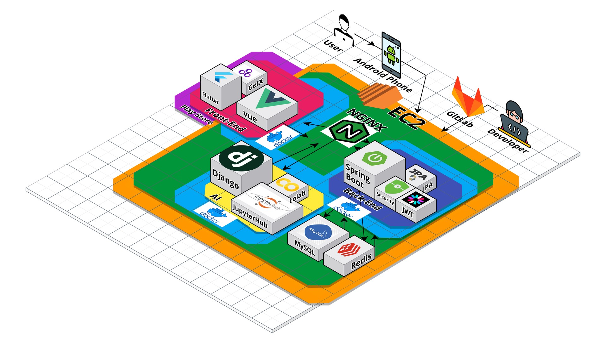
</p>

### Figma [:link:](https://www.figma.com/file/dzE2kcjSXEr0f8ZcPOtXJO/B101?node-id=475-1852&t=RBKNXaMGQN24GiHz-0)

<p align="center">
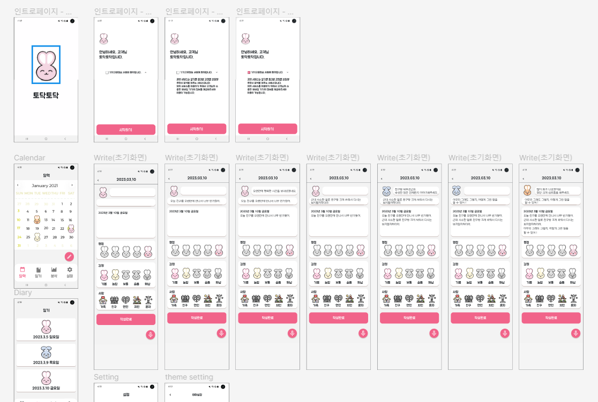
</p>

### ERD

<p align="center">
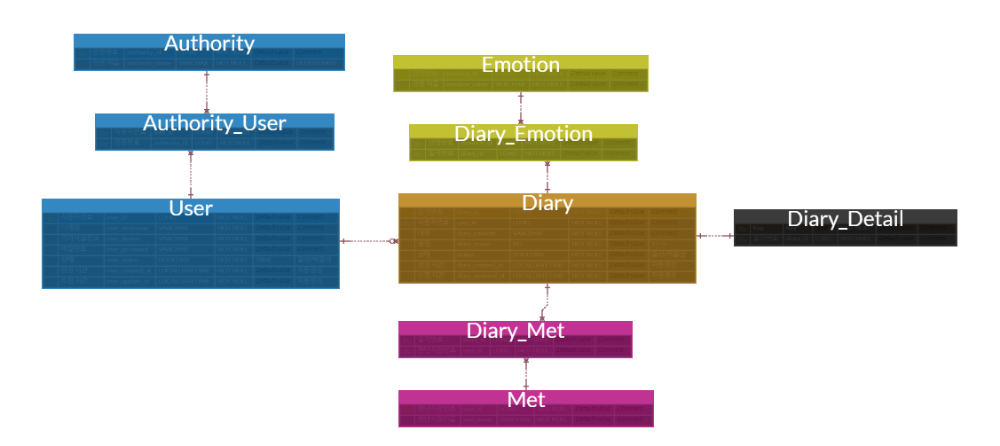
</p>

### 요구사항 명세서

<p align="center">
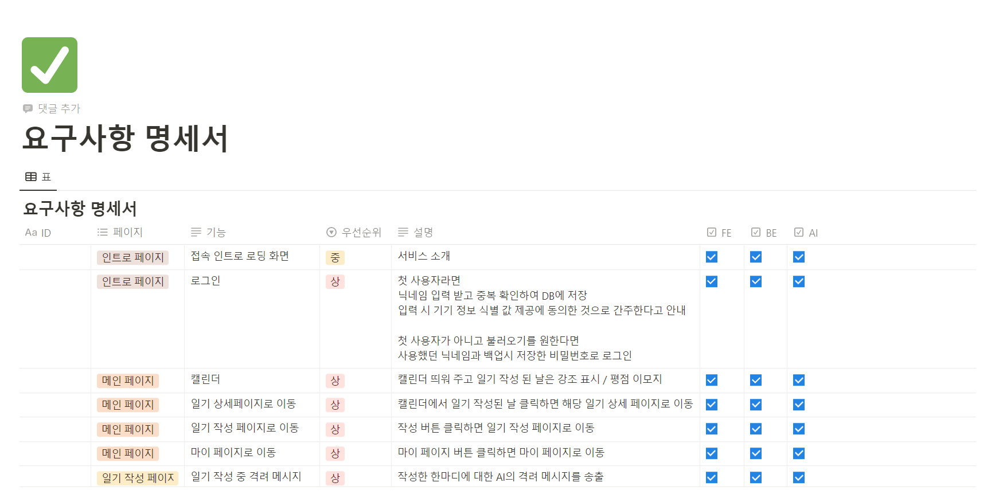
</p>

### API 명세서 [:link:](https://documenter.getpostman.com/view/25310566/2s93JxsMqe#intro)

<p align="center">
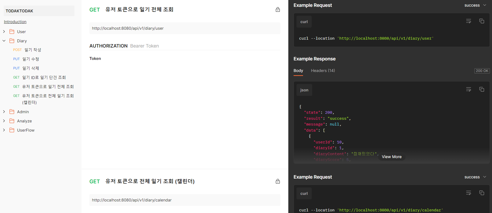
</p>

## 기능

### 메인 페이지

<p align="center">
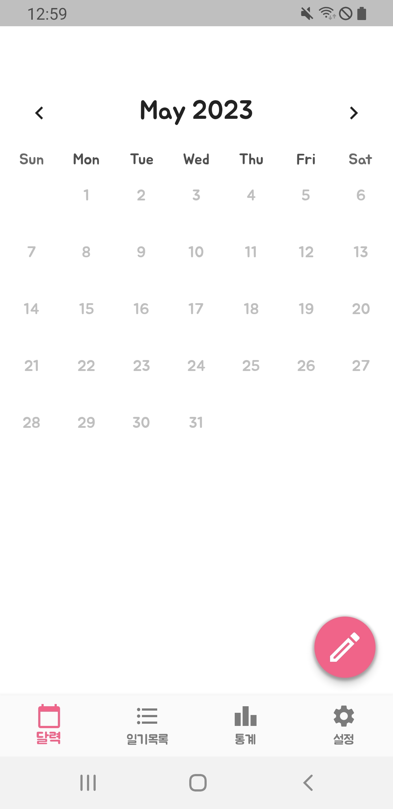
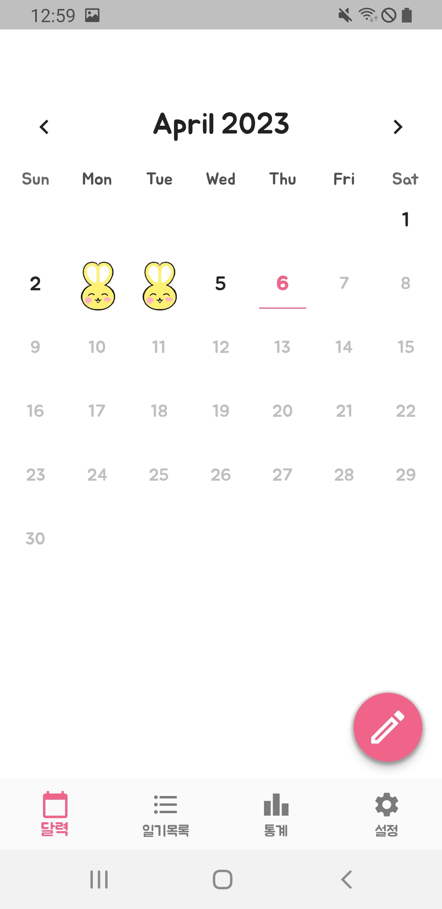
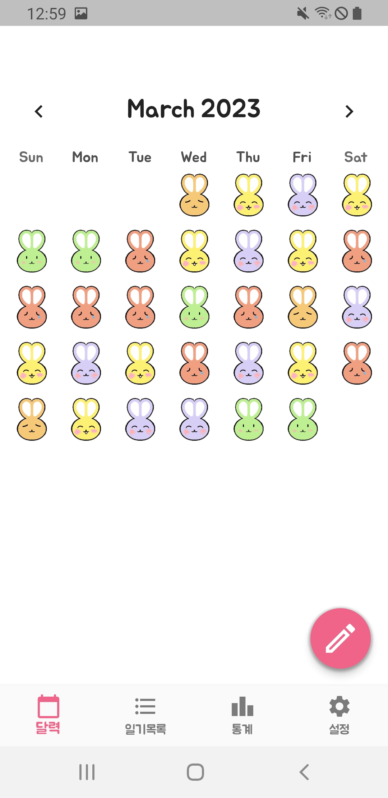
</p>

### 일기 작성

<p align="center">
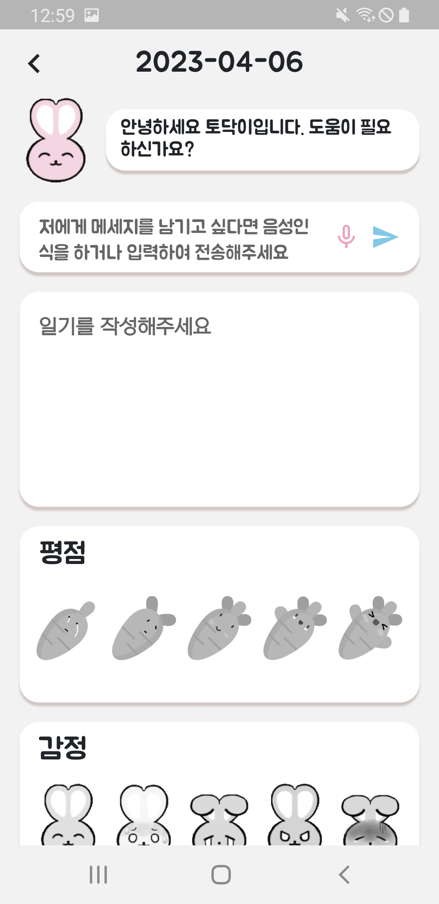
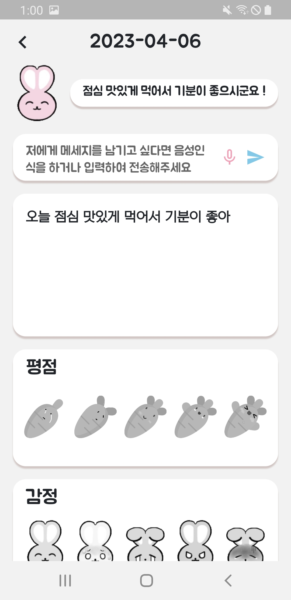
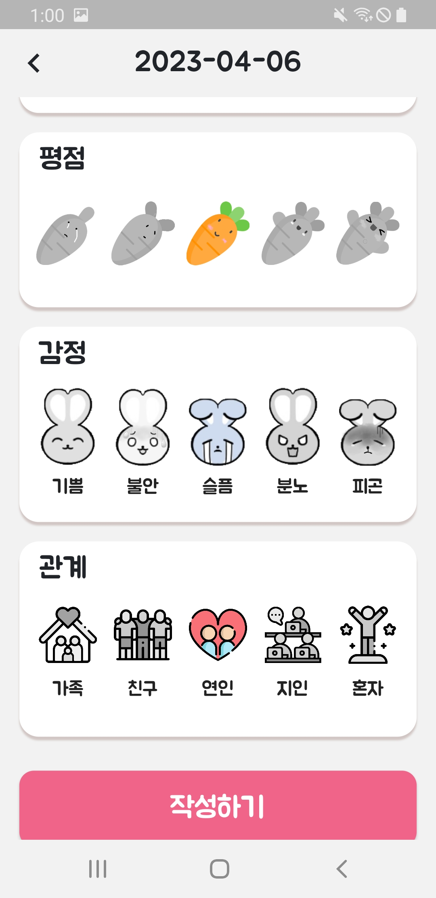
</p>

### 일기 조회

<p align="center">
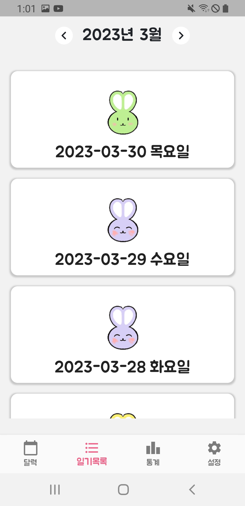
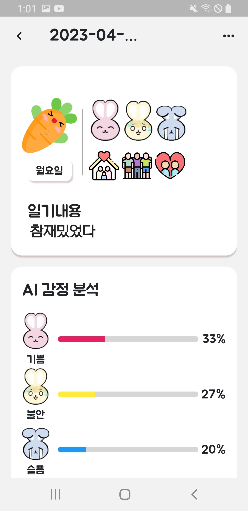
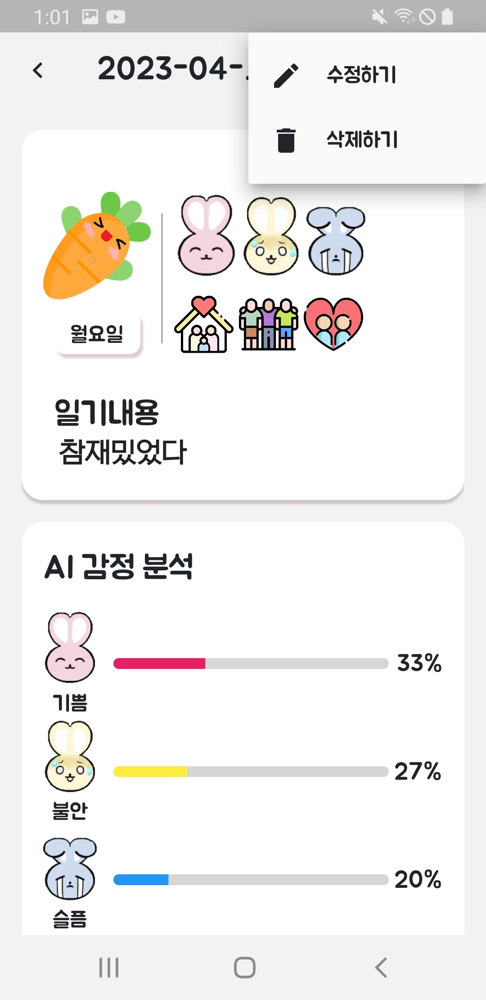
</p>

### 일기 분석

<p align="center">
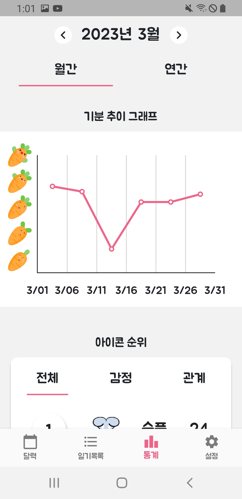
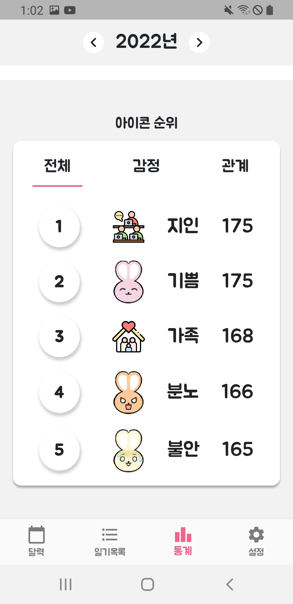
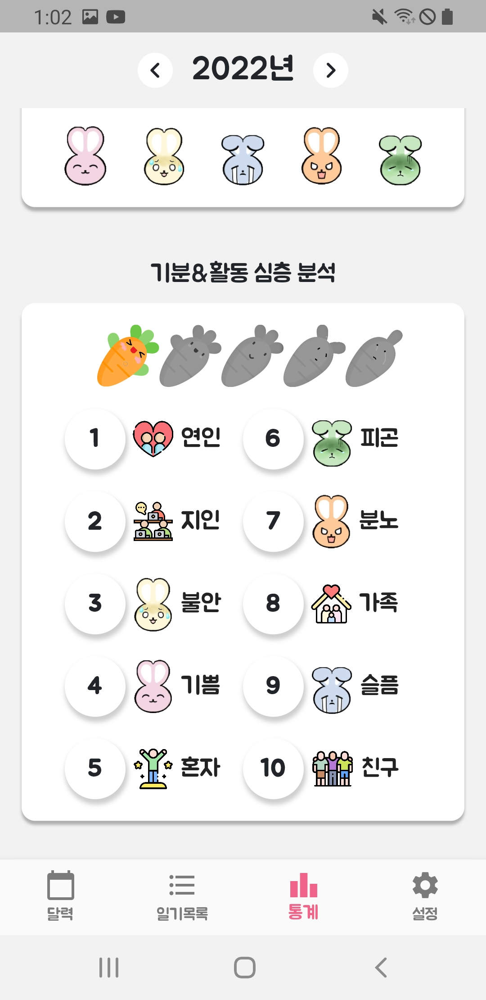
</p>

## AI

### 라이브러리

| name   | description                                                    | version | link                                            |
|:-------|:---------------------------------------------------------------|:--------|:------------------------------------------------|
| KoBERT | Korean Bidirectional Encoder Representations from Transformers | -       | [KoBERT](https://github.com/SKTBrain/KoBERT)    |
| BERT   | Bidirectional Encoder Representations from Transformers        | -       | [BERT](https://github.com/google-research/bert) |
| KoGPT2 | Korean Generative Pre-trained Transformer                      | -       | [KoGPT2](https://github.com/SKT-AI/KoGPT2)      |
| GPT2   | Generative Pre-trained Transformer                             | -       | [GPT2](https://github.com/openai/gpt-2)         |

### 디렉토리

```text
📁TodakTodak
├──📁aipjt
├──📁diarys
└──📁service
    └──📁static
        ├──📁emotion
        │   └──🤖kobert_emotion.pt 
        ├──📁kogpt
        │   └──🤖kogpt_chatbot.pt 
        └──📁kobert
            ├──🤖kobert_chatbot.pt 
            ├──📁data
            └──📁model
```

[자세한 AI 설명 링크](https://lab.ssafy.com/s08-ai-speech-sub2/S08P22B101/-/blob/AI/readme.md)

## Front-end

### 라이브러리

| name                   | description                                | version         | link                                                                                                                                                |
|:-----------------------|:-------------------------------------------|:----------------|:----------------------------------------------------------------------------------------------------------------------------------------------------|
| Flutter_secure_storage | 디바이스 내부에 정보를 저장하기 위해 보안에 최적화된 스토리지         | 8.0.0           | [flutter_secure_storage](https://pub.dev/packages/flutter_secure_storage)                                                                           |
| Get                    | 상태 관리 라이브러리                                | 4.6.5           | [get](https://pub.dev/packages/get)                                                                                                                 |
| dio                    | 서버와 통신을 하기 위해 필요한 패키지                      | 5.0.3           | [dio](https://pub.dev/packages/dio)                                                                                                                 |
| flutter_tts            | 텍스트를 음성으로 변환하는데 필요한 패키지                    | 3.6.3           | [flutter_tts](https://pub.dev/packages/flutter_tts)                                                                                                 |
| speech_to_text         | 사용자의 발화를 텍스트로 추출하기 위해 필요한 패키지              | 6.1.1           | [speech_to_text](https://pub.dev/packages/speech_to_text)                                                                                           |
| table_calendar         | flutter에서 calendar에 event를 표시하기 위해 필요한 패키지 | 3.0.1           | [table_calendar](https://pub.dev/packages/table_calendar)                                                                                           |
| device_info            | 디바이스의 정보를 얻기 위해 필요한 패키지                    | 2.0.0           | [device_info](https://pub.dev/packages/device_info)                                                                                                 |
| flutter_dotenv         | 환경변수를 관리하기 위해 필요한 패키지                      | 6.1.1           | [flutter_dotenv](https://pub.dev/packages/flutter_dotenv)                                                                                           |
| flutter_sdk            | 프로그래밍 언어로 Dart를 사용하고 기계 코드로 컴파일            | 3.9.0-7.0.pre.5 | [flutter_sdk](https://flutter.dev/?gclid=Cj0KCQjw27mhBhC9ARIsAIFsETFbWI4KD0s-qYAf5IXz6cU2uVn2H-DCi2zJR1oVDhAk3MQeiQBSgTgaAq6oEALw_wcB&gclsrc=aw.ds) |

### 디렉토리

```text
📁TodakTodak
├──📁android
│   └──📁app  
├──📁assets
│   ├──📁fonts
│   └──📁images  
├──📁lib
│   └──📁src
│     ├──📁binding
│     ├──📁components
│     │   ├──📁analysis
│     │   ├──📁auth
│     │   ├──📁calendar
│     │   ├──📁diary
│     │   │   ├──📁detail
│     │   │   ├──📁list
│     │   │   ├──📁modify
│     │   │   └──📁write
│     │   └──📁tutorial  
│     ├──📁config
│     ├──📁controller
│     │   ├──📁analysis
│     │   ├──📁auth
│     │   ├──📁calendar
│     │   ├──📁dashboard
│     │   ├──📁diary
│     │   └──📁setting
│     ├──📁model
│     │   ├──📁auth
│     │   ├──📁calendar
│     │   ├──📁chart
│     │   └──📁diary
│     ├──📁pages
│     │   ├──📁analysis
│     │   ├──📁auth
│     │   ├──📁calendar
│     │   ├──📁dashboard
│     │   ├──📁diary
│     │   └──📁setting
│     └──📁services 
│         ├──📁auth
│         ├──📁chatbot
│         └──📁diary
└──📁test
```

## Back-end

### 라이브러리

| name             | description                          | version | link                                                                                |
|:-----------------|:-------------------------------------|:--------|:------------------------------------------------------------------------------------|
| Spring Framework | Java Web Framework                   | 5.3.9   | [Spring Framework](https://spring.io/)                                              |
| Spring Boot      | Java Web Framework                   | 2.4.10  | [Spring Boot](https://spring.io/)                                                   |
| Spring Data Jpa  | Persist Data in SQL                  | 2.4.10  | [JPA](https://docs.spring.io/spring-data/jpa/docs/current/reference/html/)          |
| Query DSL        | Query Library                        | 4.4.0   | [Query DSL](http://querydsl.com/static/querydsl/3.6.3/reference/ko-KR/html_single/) |
| Spring Security  | Authentication and Access Management | 2.4.10  | [Spring Security](https://docs.spring.io/spring-security/reference/index.html)      |
| JWT Token        | Json Web Token                       | 0.11.2  | [JWT](https://jwt.io/)                                                              |
| MySQL            | Database                             | 8.0.32  | [MySQL](https://dev.mysql.com/doc/)                                                 |
| Swagger Ui2      | API Document                         | 3.0.0   | [Swagger](https://swagger.io/docs/)                                                 |

### 디렉토리

```text
📁TodakTodak
├──📁controller
└──📁model
    ├──📁dto
    │   ├──📁request
    │   └──📁response
    ├──📁entity
    ├──📁repository
    └──📁service
```

## 🏃 Team Group
<table>
    <tr>
        <td align="center">
            <b>FE</b><br />
            
            <br/>
            <sub>
                <b>김지환</b>
                <br/>
                
            </sub>
            <br/>
        </td>
        <td align="center">
            <b>FE</b><br />
            
            <br/>
            <sub>
                <b>류원창</b>
                <br/>
                
            </sub>
            <br/>
        </td>
        <td align="center">
            <b>BE</b><br />
            
            <br/>
            <sub>
                <b>이지은</b>
                <br/>
                
            </sub>
            <br/>
        </td>
        <td align="center">
            <b>BE</b><br />
            
            <br/>
            <sub>
                <b>정현석</b>
                <br/>
                
            </sub>
            <br/>
        </td>
        <td align="center">
            <b>AI</b><br />
            
            <br/>
            <sub>
                <b>소채린</b>
                <br/>
                
            </sub>
            <br/>
        </td>
        <td align="center">
            <b>AI</b><br />
            
            <br/>
            <sub>
                <b>조용관</b>
                <br/>
                
            </sub>
            <br/>
        </td>
    </tr>
</table>


<br />
