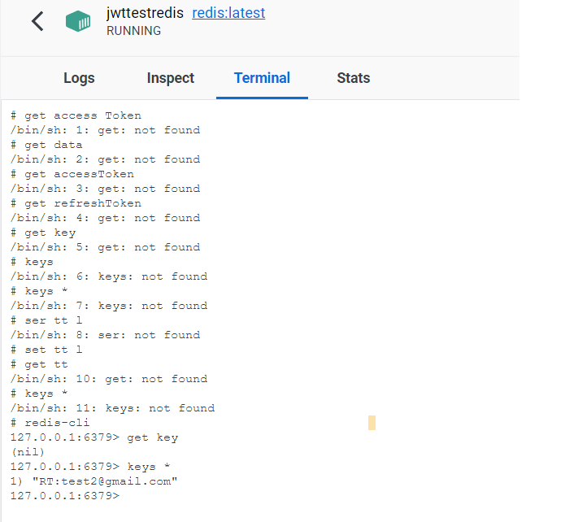
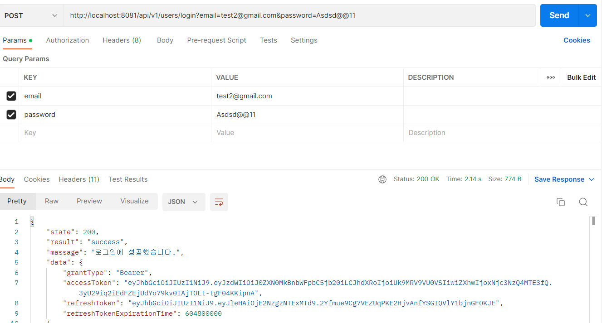

## 03월 02일 목요일  
- [x] BE 프로젝트 build 및 application 설정
- [x] Spring Boot 프로젝트 JPA, JWT, Security, redis 이용한 로그인 학습 및 실습

## 실습 내용

### docker redis 저장된 key 조회

- 고유 식별자 key로 사용자 ID 이용
### security 로그인 구현

- 회원가입 / 로그인 확인 
- 로그인 시 token 확인